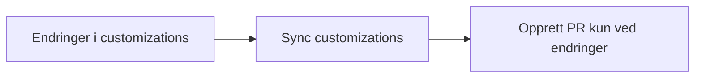

# Copilot customizations for team min-side

[](https://github.com/navikt/tms-copilot/actions/workflows/tms-copilot-sync.yml)


Dette repoet samler gjenbrukbare Copilot customizations som team min-side kan bruke direkte, og dele videre til andre repoer ved behov.

## Formål

Repoet er et dokumentasjons- og innholdsrepo for Copilot-tilpasninger. Målgruppen er utviklere som vedlikeholder agentinstruksjoner, og som trenger:

- tydelige skills for konkrete arbeidsflyter
- en enkel måte å oppdatere skills og instructions på tvers av repoer
- et felles sted for å videreutvikle instruksjonene

## Skills i repoet

Alle skills ligger under `.github/skills/`, med egen `SKILL.md` per skill.

- `caveman`: ultra-komprimert kommunikasjonsmodus
- `grill-me`: strukturert intervju for å stressteste planer
- `issue-planner`: avklaring og opprettelse av issues fra templates
- `readme-update`: oppdatering av README/repo-dokumentasjon
- `write-a-skill`: opprette nye skills med riktig struktur

## Instructions i repoet

Repoet inneholder også delte instruction-filer under `.github/instructions/` som kan brukes av agenter i kompatible kodebaser.

- `astro-aksel.instructions.md`: retningslinjer for Astro/Aksel-filer
- `astro-aksel.metadata.json`: metadata for instruction-regelen

## Flyt for synk av skills og instructions



Repoet inneholder en reusable workflow for å kopiere `.github/skills/**` og `.github/instructions/**` til teamrepoer:

```yaml
name: Customizations Sync

on:
  schedule:
    - cron: '0 7 * * 1'
  workflow_dispatch:

jobs:
  sync:
    uses: navikt/tms-copilot/.github/workflows/tms-copilot-sync.yml@main
    permissions:
      contents: write
      pull-requests: write
```

Workflowen kopierer skill- og instruction-mapper, oppretter PR bare når noe faktisk er endret, og lar eventuelle ekstra lokale mapper i målrepoet ligge urørt.

## Utvikling

Dette repoet publiserer ikke en egen app med lokal URL. For oppdatert oversikt over automatisering og tilgjengelige workflows, bruk `gh workflow list` eller se `.github/workflows/`.

## For Nav-ansatte

Kontakt teamet i [#team-minside på Slack](https://nav-it.slack.com/app_redirect?channel=team-minside).